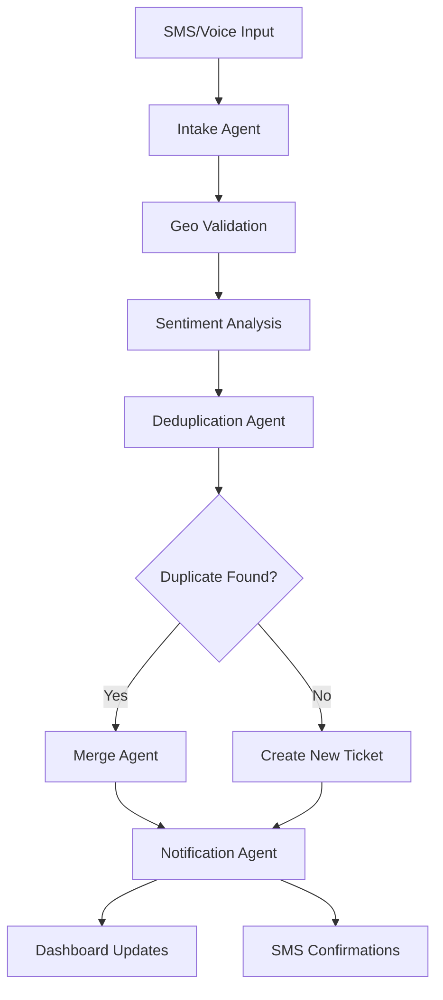

# 🏛️ CivicSense - AI-Powered 311 & Property Issue Reporter

[](https://opensource.org/licenses/MIT)
[](https://nodejs.org/)
[](https://www.typescriptlang.org/)
[](https://supabase.com/)

> A **multi-agent AI system** for handling municipal issue reporting via SMS and voice with automatic deduplication, location validation, and real-time notifications.


## 🌟 Features

### 🤖 **Multi-Agent Workflow**
- **Intake Agent**: Extracts structured data using LLMs (OpenAI/Anthropic)
- **Geo Validation**: Google Maps geocoding + city boundary validation
- **Smart Deduplication**: Vector embeddings + geo-proximity + time windows
- **Sentiment Analysis**: Emotional tone classification and urgency detection
- **Auto-Merge**: Combines duplicate reports under parent tickets
- **Real-time Notifications**: SMS confirmations and daily digests

### 📱 **Multi-Channel Intake**
- **SMS Reports**: Twilio webhook integration with OTP verification
- **Voice Reports**: Audio transcription via OpenAI Whisper
- **Rate Limiting**: Anti-spam protection (5 reports/day per phone)
- **Privacy-First**: Phone number hashing, no PII storage

### 📊 **Real-Time Dashboard**
- Live metrics and KPI display (Streamlit)
- Interactive ticket management
- Geographic distribution mapping
- Sentiment analysis visualization
- Recent activity feed with auto-refresh

### 🏗️ **Scalable Architecture**
- **Backend**: Supabase (PostgreSQL + Vector DB + Edge Functions)
- **API**: Express.js with TypeScript
- **Agents**: LangGraph-style state management
- **Hosting**: Vercel-ready with Supabase Edge Functions

## 🚀 Quick Start

### Prerequisites
- **Node.js** 18+
- **Python** 3.8+ (for dashboard)
- **Supabase CLI** ([install guide](https://supabase.com/docs/guides/cli))
- **API Keys**: Twilio, OpenAI/Anthropic, Google Maps

### 1. **Clone & Setup**
```bash
git clone https://github.com/your-org/civicsense.git
cd civicsense

# Copy environment template
cp .env.example .env.local
# 🔑 Edit .env.local with your API keys
```

### 2. **One-Command Setup**
```bash
make demo    # Installs deps, sets up DB, seeds demo data
```

### 3. **Start Development**
```bash
make dev     # Starts API server + Streamlit dashboard
```

**🎯 You're ready!**
- 📊 **Dashboard**: http://localhost:8501
- 🔗 **API**: http://localhost:3000
- 📱 **SMS Endpoint**: `POST /webhooks/sms`

## 📋 Project Structure

```
civicsense/
├── src/
│   ├── agents/           # 🤖 LangGraph workflow nodes
│   │   ├── intake.ts     # Data extraction from SMS/voice
│   │   ├── validate-geo.ts  # Location validation
│   │   ├── dedup.ts      # Duplicate detection & merging
│   │   ├── sentiment.ts  # Emotional analysis
│   │   └── notify.ts     # User notifications
│   ├── routes/           # 🌐 Express API endpoints
│   ├── services/         # 🔧 Core business logic
│   ├── types/           # 📝 TypeScript definitions
│   └── utils/           # 🛠️ Utility functions
├── supabase/
│   ├── functions/       # ⚡ Edge Functions (cron jobs)
│   └── migrations/      # 🗄️ Database schema
├── dashboard/           # 📊 Streamlit analytics dashboard
├── scripts/            # 🧪 Testing & seed utilities
└── data/              # 🗺️ City boundary GeoJSON files
```

## 🎭 Demo Scenario

**Perfect for hackathon demonstrations:**

1. **👤 Alice texts**: `"There's a pothole at Broad & Market"`
2. **👤 Bob texts**: `"Big pothole near Broad & Market by the bus stop"`
3. **🤖 System auto-merges** under parent ticket `#P101`
4. **📊 Dashboard updates** live with parent + child count
5. **📱 Nightly digest** SMS sent to both reporters

## 🛠️ Development Commands

```bash
# 🚀 Development
make dev              # Start both API + Dashboard
make api-dev          # Start only API server
make dashboard-dev    # Start only Streamlit dashboard

# 🗄️ Database
make db-reset         # Fresh database with migrations
make seed             # Load demo data
make db-migrate       # Run pending migrations

# 🧪 Testing
make test             # Run workflow tests
make demo             # Full demo setup

# 🔧 Utilities
make func-serve       # Serve Edge Functions locally
make build            # Build TypeScript
make clean            # Clean build artifacts
make status           # Check service status
```

## 🏗️ Architecture Overview

### **Data Flow**


### **Tech Stack**
- **🔥 Backend**: Supabase (PostgreSQL + pgVector + Realtime)
- **🚀 API**: Express.js + TypeScript + Zod validation
- **🤖 AI/ML**: OpenAI GPT-3.5/4 + Anthropic Claude + ada-002 embeddings
- **📱 Communications**: Twilio (SMS + Voice + Verify)
- **🗺️ Location**: Google Maps Geocoding API
- **📊 Dashboard**: Streamlit + Plotly + Pandas
- **⚡ Functions**: Supabase Edge Functions (Deno)
- **🚀 Hosting**: Vercel + Supabase Cloud

## 🔧 API Documentation

### **Core Endpoints**

#### SMS Webhook
```http
POST /webhooks/sms
Content-Type: application/x-www-form-urlencoded

From=+15551234567&Body=Pothole at Broad and Market&MessageSid=SM123
```

#### Dashboard Data
```http
GET /dashboard/{orgId}

Response:
{
  "metrics": {
    "open_parent_tickets": 12,
    "total_open_tickets": 28,
    "merged_tickets": 16,
    "critical_open": 3
  },
  "parentTickets": [...],
  "recentActivity": [...]
}
```

#### OTP Verification
```http
POST /verify/check
Content-Type: application/json

{
  "phone": "+15551234567",
  "code": "123456"
}
```

## 🧪 Testing

### **Manual Testing**
```bash
# Test SMS workflow
make test

# Test specific endpoints
curl -X POST http://localhost:3000/webhooks/sms \
  -d "From=+15551234567&Body=Test pothole report"
```

### **Load Demo Data**
```bash
make seed    # Creates org + users + sample tickets
```

## 🚀 Deployment

### **Vercel + Supabase (Recommended)**

1. **Deploy to Vercel**:
```bash
npm i -g vercel
vercel --prod
```

2. **Setup Supabase Cloud**:
- Create project at [supabase.com](https://supabase.com)
- Run migrations: `supabase db push`
- Deploy Edge Functions: `supabase functions deploy`

3. **Configure Environment**:
- Set production environment variables in Vercel
- Update Twilio webhook URLs
- Configure CORS origins

### **Environment Variables**
```bash
# Required for production
TWILIO_ACCOUNT_SID=ACxxxxx
TWILIO_AUTH_TOKEN=xxxxx
OPENAI_API_KEY=sk-xxxxx
GOOGLE_MAPS_API_KEY=xxxxx
SUPABASE_URL=https://xxx.supabase.co
SUPABASE_SERVICE_ROLE_KEY=xxxxx
BASE_URL=https://your-app.vercel.app
```

## 🤝 Contributing

We welcome contributions! Please see our [Contributing Guide](CONTRIBUTING.md) for details.

### **Development Setup**
1. Fork the repository
2. Create feature branch: `git checkout -b feature/amazing-feature`
3. Make changes and test: `make test`
4. Commit: `git commit -m 'Add amazing feature'`
5. Push: `git push origin feature/amazing-feature`
6. Open Pull Request

### **Code Style**
- **TypeScript**: Strict mode enabled
- **ESLint + Prettier**: Automated formatting
- **Conventional Commits**: Use semantic commit messages
- **Tests**: Add tests for new features

## 🔒 Security

- **Phone Privacy**: SHA-256 hashed, never stored in plain text
- **Rate Limiting**: 5 reports per phone per day
- **OTP Verification**: Required before first report
- **Input Validation**: Zod schemas + SQL injection protection
- **CORS**: Configured for production domains only

Found a security issue? Please email security@civicsense.dev

## 📄 License

This project is licensed under the MIT License - see the [LICENSE](LICENSE) file for details.

## 🙏 Acknowledgments

- **Supabase** for the amazing backend platform
- **Twilio** for reliable communications infrastructure
- **OpenAI** & **Anthropic** for powerful AI capabilities
- **LangGraph** for inspiring the agent workflow design

## 🆘 Support

- 📖 **Documentation**: [Wiki](https://github.com/your-org/civicsense/wiki)
- 🐛 **Issues**: [GitHub Issues](https://github.com/your-org/civicsense/issues)
- 💬 **Discussions**: [GitHub Discussions](https://github.com/your-org/civicsense/discussions)
- 📧 **Email**: support@civicsense.dev

---

**Built with ❤️ for municipalities and their citizens**